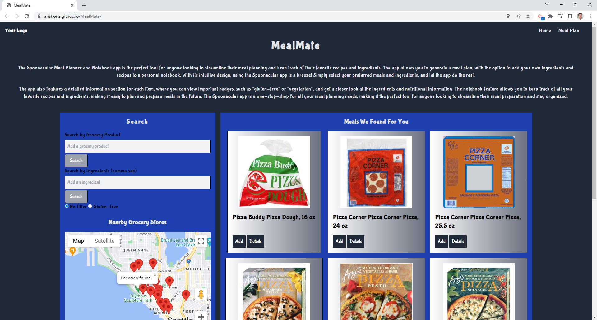
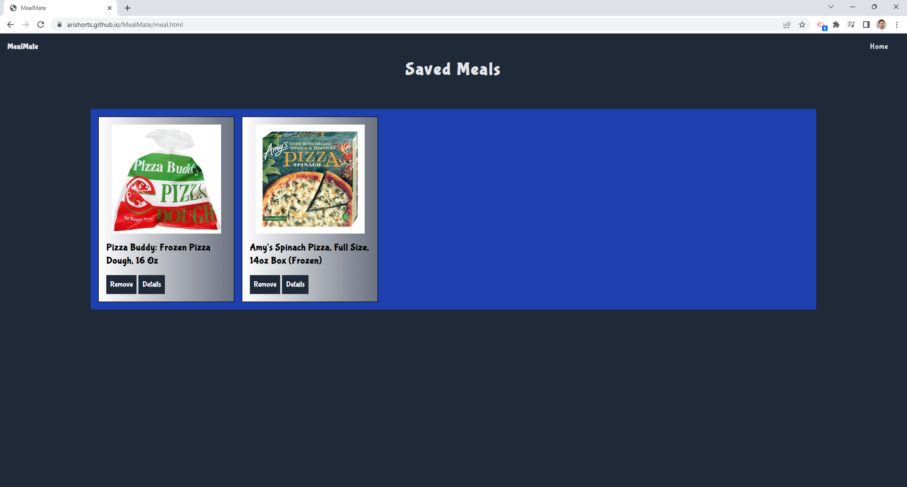

# MealMate

## Description

This website combines the power of two third-party-APIs which allows you to be able to seek out meal plans and ingredients for your week. Not only does this third-party-API allow the user to find the proper meal and help plan their week with what they want to eat, it guides them to the places nearby that have those items that they are searching for, either to have some ingredients or to heat up a quick meal.

### User Story:

AS A health consicous individual
I WANT to plan my meals
SO THAT I can be a be healthier

## Table of Contents (Optional)

- [Installation](#installation)
- [Usage](#usage)
- [Badges](#badges)
- [How_to_Contribute](#how_to_contribute)
- [Credits](#credits)
- [License](#license)

## Installation

No installation needed.

## Usage

The website can be found at: https://arishorts.github.io/MealMate/

The Spoonacular Meal Planner and Notebook app is the perfect tool for anyone looking to streamline their meal planning and keep track of their favorite recipes and ingredients. The app allows you to generate a meal plan, with the option to add your own ingredients and recipes to a personal notebook. With its intuitive design, using the Spoonacular app is a breeze! Simply select your preferred meals and ingredients, and let the app do the rest.

The app also features a detailed information section for each item, where you can view important badges, such as "gluten-free" or "vegetarian", and get a closer look at the ingredients and nutritional information. The notebook feature allows you to keep track of all your favorite recipes and ingredients, making it easy to plan and prepare meals in the future. The Spoonacular app is a one-stop-shop for all your meal planning needs, making it the perfect tool for anyone looking to streamline their meal preparation and stay organized.  

## Badges

 
 

## How_to_Contribute

If you would like to contribute, refer to the [Contributor Covenant](https://www.contributor-covenant.org/)

## Credits

- Mosh Hamedani: https://codewithmosh.com/
- Spoonacular API : https://spoonacular.com/food-api/docs
- Google Maps API : https://developers.google.com/maps/documentation/javascript/overview
- Google Place API : //https://developers.google.com/maps/documentation/javascript/places
- Mozilla : https://developer.mozilla.org/en-US/docs/Web/API/Geolocation/getCurrentPosition
- Jsfiddle : http://jsfiddle.net/2crQ7/

## License

MIT License https://choosealicense.com/licenses/mit/

---

© 2023 MealMate LLC. Confidential and Proprietary. All Rights Reserved.
